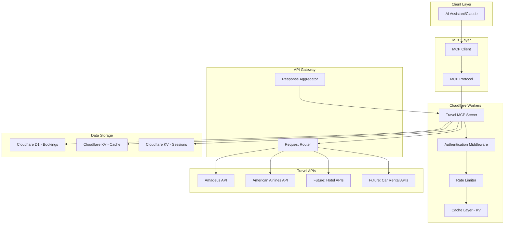
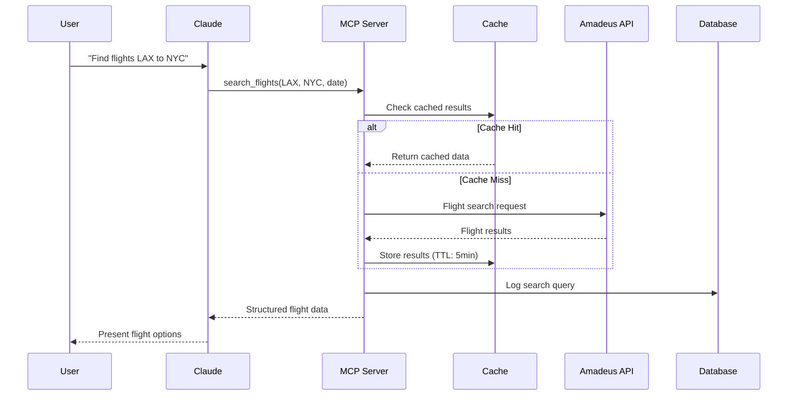
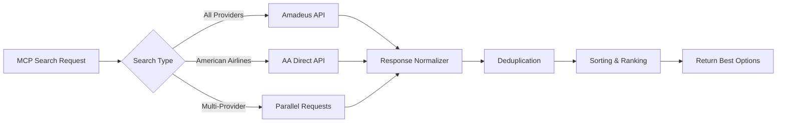
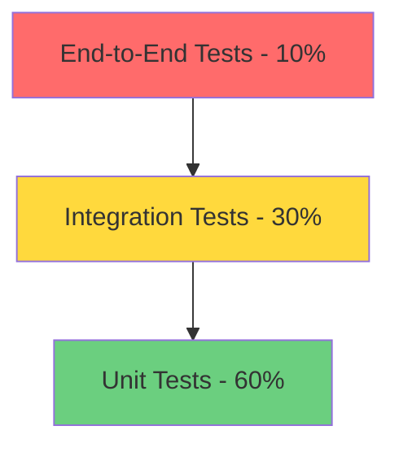
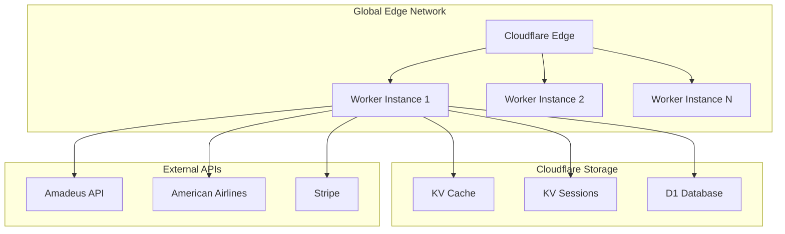
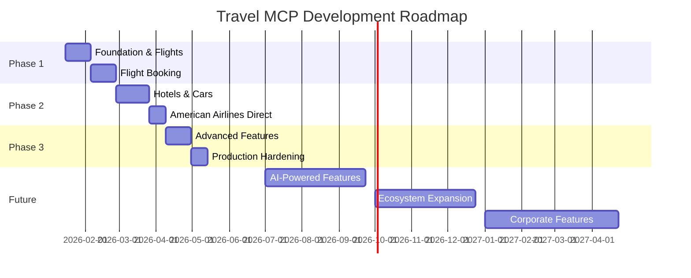

# Travel MCP Server - Technical Scope Document

**Version:** 1.0
**Date:** January 21, 2026
**Status:** Draft
**Document Owner:** Engineering Team

---

## Table of Contents

1. [Executive Summary](#1-executive-summary)
2. [Architecture Overview](#2-architecture-overview)
3. [API Integration Strategy](#3-api-integration-strategy)
4. [Feature Requirements](#4-feature-requirements)
5. [MCP Tool Definitions](#5-mcp-tool-definitions)
6. [Implementation Phases](#6-implementation-phases)
7. [Security & Authentication](#7-security--authentication)
8. [Error Handling & Rate Limiting](#8-error-handling--rate-limiting)
9. [Testing Strategy](#9-testing-strategy)
10. [Deployment Plan](#10-deployment-plan)
11. [Cost Analysis](#11-cost-analysis)
12. [Future Enhancement Roadmap](#12-future-enhancement-roadmap)

---

## 1. Executive Summary

### 1.1 Project Overview

The Travel MCP Server is a Model Context Protocol (MCP) connector that provides AI assistants with real-time access to travel booking data across flights, hotels, and car rentals. By integrating with major travel APIs, this server enables natural language travel planning and booking capabilities.

### 1.2 Key Objectives

- **Unified Travel Interface**: Single MCP server for all travel-related queries
- **Multi-Provider Support**: Amadeus API as primary aggregator + direct airline integrations
- **Real-Time Data**: Live pricing, availability, and booking capabilities
- **Scalable Architecture**: Cloudflare Workers for global edge deployment
- **Cost Efficiency**: Serverless architecture with usage-based pricing

### 1.3 Business Value

- **Enhanced User Experience**: Natural language travel booking through AI assistants
- **Market Differentiation**: First-to-market MCP travel integration
- **Revenue Opportunity**: Affiliate commissions and booking fees
- **Scalability**: Global edge deployment supports millions of requests

### 1.4 Key Metrics

| Metric | Target |
|--------|--------|
| API Response Time | < 2s (p95) |
| Availability | 99.9% uptime |
| Cost per 1K requests | < $0.50 |
| Supported Markets | 50+ countries |

---

## 2. Architecture Overview

### 2.1 System Architecture



### 2.2 Component Breakdown

#### 2.2.1 MCP Server Core
- **Technology**: TypeScript/Node.js on Cloudflare Workers
- **Protocol**: MCP (Model Context Protocol)
- **Runtime**: Edge computing with sub-50ms cold starts

#### 2.2.2 API Integration Layer
- **Primary Provider**: Amadeus Self-Service API
- **Direct Integrations**: American Airlines API
- **Fallback Strategy**: Multiple provider redundancy

#### 2.2.3 Data Flow



### 2.3 Technology Stack

| Layer | Technology | Justification |
|-------|-----------|---------------|
| Runtime | Cloudflare Workers | Global edge deployment, 0ms cold start |
| Language | TypeScript | Type safety, excellent MCP SDK support |
| Protocol | MCP | Standard for AI assistant integrations |
| Database | Cloudflare D1 (SQLite) | Serverless SQL, low latency |
| Cache | Cloudflare KV | Distributed key-value store |
| API Client | Fetch API | Native to Workers runtime |
| Validation | Zod | Runtime type validation |

---

## 3. API Integration Strategy

### 3.1 Primary Integration: Amadeus API

#### 3.1.1 Overview
Amadeus Self-Service API provides comprehensive travel data aggregation:
- **Flights**: 490+ airlines across 130+ countries
- **Hotels**: 150,000+ properties worldwide
- **Car Rentals**: Major rental companies
- **Airport Data**: Global airport information

#### 3.1.2 API Endpoints Mapping

| Capability | Amadeus Endpoint | Rate Limit |
|-----------|------------------|------------|
| Flight Search | `/shopping/flight-offers` | 10 req/sec |
| Flight Price | `/shopping/flight-offers/pricing` | 10 req/sec |
| Flight Booking | `/booking/flight-orders` | 5 req/sec |
| Hotel Search | `/shopping/hotel-offers` | 10 req/sec |
| Hotel Booking | `/booking/hotel-bookings` | 5 req/sec |
| Car Search | `/shopping/transfer-offers` | 10 req/sec |

#### 3.1.3 Authentication Flow

```typescript
// Amadeus OAuth2 Token Management
interface AmadeusAuthConfig {
  clientId: string;
  clientSecret: string;
  tokenEndpoint: string;
}

class AmadeusAuthManager {
  private token: string | null = null;
  private tokenExpiry: number = 0;

  async getAccessToken(): Promise<string> {
    if (this.token && Date.now() < this.tokenExpiry) {
      return this.token;
    }

    const response = await fetch('https://api.amadeus.com/v1/security/oauth2/token', {
      method: 'POST',
      headers: { 'Content-Type': 'application/x-www-form-urlencoded' },
      body: new URLSearchParams({
        grant_type: 'client_credentials',
        client_id: this.config.clientId,
        client_secret: this.config.clientSecret,
      }),
    });

    const data = await response.json();
    this.token = data.access_token;
    this.tokenExpiry = Date.now() + (data.expires_in * 1000) - 60000; // 1min buffer

    return this.token;
  }
}
```

### 3.2 Secondary Integration: American Airlines API

#### 3.2.1 Direct Integration Benefits
- **Priority Access**: Direct airline inventory
- **Enhanced Data**: Seat maps, amenities, loyalty program info
- **Real-Time Updates**: Gate changes, delays, cancellations
- **Exclusive Fares**: Airline-specific promotions

#### 3.2.2 Integration Architecture

```typescript
interface AirlineProvider {
  searchFlights(params: FlightSearchParams): Promise<FlightOffer[]>;
  getFlightDetails(offerId: string): Promise<FlightDetails>;
  createBooking(booking: BookingRequest): Promise<BookingConfirmation>;
}

class AmericanAirlinesProvider implements AirlineProvider {
  private readonly baseUrl = 'https://api.aa.com/v1';

  async searchFlights(params: FlightSearchParams): Promise<FlightOffer[]> {
    const response = await fetch(`${this.baseUrl}/offers/flights`, {
      method: 'POST',
      headers: {
        'Authorization': `Bearer ${await this.getToken()}`,
        'Content-Type': 'application/json',
      },
      body: JSON.stringify({
        originLocationCode: params.origin,
        destinationLocationCode: params.destination,
        departureDate: params.departureDate,
        adults: params.passengers,
      }),
    });

    return this.transformAAResponse(await response.json());
  }
}
```

### 3.3 API Aggregation Strategy



### 3.4 Response Normalization

```typescript
interface NormalizedFlightOffer {
  id: string;
  provider: 'amadeus' | 'american_airlines' | 'united';
  price: {
    total: number;
    currency: string;
    breakdown: PriceBreakdown;
  };
  itinerary: FlightItinerary[];
  validatingAirline: string;
  bookable: boolean;
  deepLink?: string;
}

class ResponseNormalizer {
  normalize(provider: string, rawData: any): NormalizedFlightOffer[] {
    switch (provider) {
      case 'amadeus':
        return this.normalizeAmadeus(rawData);
      case 'american_airlines':
        return this.normalizeAA(rawData);
      default:
        throw new Error(`Unknown provider: ${provider}`);
    }
  }
}
```

---

## 4. Feature Requirements

### 4.1 Flight Search & Booking

#### 4.1.1 Search Capabilities

| Feature | Priority | Complexity | API Support |
|---------|----------|------------|-------------|
| One-way flights | P0 | Low | Amadeus, AA |
| Round-trip flights | P0 | Low | Amadeus, AA |
| Multi-city flights | P1 | Medium | Amadeus, AA |
| Flexible dates (+/- 3 days) | P1 | Medium | Amadeus |
| Cabin class filtering | P0 | Low | Amadeus, AA |
| Non-stop only filter | P0 | Low | Amadeus, AA |
| Airline preference | P1 | Low | Amadeus, AA |
| Price alerts | P2 | High | Custom |

#### 4.1.2 Booking Features

```typescript
interface FlightBookingRequest {
  offerId: string;
  passengers: Passenger[];
  contactInfo: ContactInfo;
  payment: PaymentInfo;
  specialRequests?: SpecialRequest[];
  loyaltyPrograms?: LoyaltyProgram[];
}

interface Passenger {
  type: 'adult' | 'child' | 'infant';
  firstName: string;
  lastName: string;
  dateOfBirth: string;
  gender: 'M' | 'F';
  passportNumber?: string;
  passportExpiry?: string;
  nationality?: string;
  knownTravelerNumber?: string;
  seatPreference?: string;
  mealPreference?: string;
}
```

### 4.2 Hotel Search & Booking

#### 4.2.1 Search Parameters

```typescript
interface HotelSearchParams {
  // Location
  cityCode?: string;
  latitude?: number;
  longitude?: number;
  radius?: number;
  radiusUnit?: 'KM' | 'MILE';

  // Dates
  checkInDate: string; // ISO 8601
  checkOutDate: string;

  // Guests
  adults: number;
  children?: number;
  childAges?: number[];
  rooms?: number;

  // Filters
  minPrice?: number;
  maxPrice?: number;
  currency?: string;
  ratings?: number[]; // [3, 4, 5]
  amenities?: string[]; // ['WIFI', 'POOL', 'GYM']
  boardType?: 'ROOM_ONLY' | 'BREAKFAST' | 'HALF_BOARD' | 'FULL_BOARD';

  // Sorting
  sortBy?: 'PRICE' | 'DISTANCE' | 'RATING' | 'POPULARITY';
  sortOrder?: 'ASC' | 'DESC';
}
```

#### 4.2.2 Hotel Response Schema

```typescript
interface HotelOffer {
  id: string;
  hotelId: string;
  name: string;
  rating: number; // 1-5
  location: {
    latitude: number;
    longitude: number;
    address: Address;
  };
  photos: string[];
  description: string;
  amenities: Amenity[];
  rooms: RoomOffer[];
  reviews: {
    averageScore: number;
    totalReviews: number;
    source: string;
  };
  cancellationPolicy: CancellationPolicy;
}

interface RoomOffer {
  id: string;
  name: string;
  description: string;
  bedType: string;
  maxOccupancy: number;
  photos: string[];
  price: {
    total: number;
    currency: string;
    breakdown: {
      baseRate: number;
      taxes: number;
      fees: number;
    };
  };
  availability: number; // rooms left
  boardType: string;
  refundable: boolean;
}
```

### 4.3 Car Rental Search & Booking

#### 4.3.1 Search Capabilities

```typescript
interface CarRentalSearchParams {
  // Pickup
  pickupLocationCode: string; // Airport/city code
  pickupDateTime: string; // ISO 8601
  pickupAddress?: Address;

  // Dropoff
  dropoffLocationCode: string;
  dropoffDateTime: string;
  dropoffAddress?: Address;

  // Renter
  driverAge: number;

  // Preferences
  carType?: 'ECONOMY' | 'COMPACT' | 'MIDSIZE' | 'STANDARD' | 'FULLSIZE' | 'SUV' | 'LUXURY';
  transmission?: 'AUTOMATIC' | 'MANUAL';
  fuelPolicy?: 'FULL_TO_FULL' | 'SAME_TO_SAME';

  // Filters
  minPrice?: number;
  maxPrice?: number;
  currency?: string;
  vendors?: string[]; // ['HERTZ', 'AVIS', 'ENTERPRISE']
}

interface CarRentalOffer {
  id: string;
  vendor: {
    code: string;
    name: string;
    logo: string;
  };
  vehicle: {
    category: string;
    make: string;
    model: string;
    year: number;
    transmission: string;
    passengers: number;
    bags: number;
    airConditioning: boolean;
    photo: string;
  };
  price: {
    total: number;
    currency: string;
    breakdown: {
      baseRate: number;
      taxes: number;
      fees: Fee[];
    };
    perDay: number;
  };
  pickupLocation: Location;
  dropoffLocation: Location;
  mileage: {
    unlimited: boolean;
    included?: number;
    unit?: 'KM' | 'MILE';
    extraCost?: number;
  };
  insurance: InsuranceOption[];
  cancellationPolicy: CancellationPolicy;
}
```

### 4.4 Additional Features

#### 4.4.1 Trip Management

```typescript
interface Trip {
  id: string;
  userId: string;
  name: string;
  startDate: string;
  endDate: string;
  destinations: string[];
  flights: FlightBooking[];
  hotels: HotelBooking[];
  cars: CarRentalBooking[];
  status: 'planning' | 'booked' | 'in_progress' | 'completed' | 'cancelled';
  totalCost: {
    amount: number;
    currency: string;
  };
  createdAt: string;
  updatedAt: string;
}
```

#### 4.4.2 Price Tracking

```typescript
interface PriceAlert {
  id: string;
  userId: string;
  type: 'flight' | 'hotel' | 'car';
  searchParams: any;
  targetPrice?: number;
  priceDropPercentage?: number; // Alert on 10% drop
  expiresAt: string;
  notificationChannels: ('email' | 'sms' | 'push')[];
  lastCheckedAt: string;
  currentPrice?: number;
}
```

---

## 5. MCP Tool Definitions

### 5.1 Flight Tools

#### 5.1.1 search_flights

```typescript
{
  name: "search_flights",
  description: "Search for flight options between two locations with flexible parameters",
  inputSchema: {
    type: "object",
    properties: {
      origin: {
        type: "string",
        description: "IATA airport code for departure (e.g., 'LAX')"
      },
      destination: {
        type: "string",
        description: "IATA airport code for arrival (e.g., 'JFK')"
      },
      departureDate: {
        type: "string",
        description: "Departure date in ISO 8601 format (YYYY-MM-DD)"
      },
      returnDate: {
        type: "string",
        description: "Return date for round-trip (optional)"
      },
      passengers: {
        type: "object",
        properties: {
          adults: { type: "number", minimum: 1, maximum: 9 },
          children: { type: "number", minimum: 0, maximum: 8 },
          infants: { type: "number", minimum: 0, maximum: 8 }
        },
        required: ["adults"]
      },
      cabinClass: {
        type: "string",
        enum: ["ECONOMY", "PREMIUM_ECONOMY", "BUSINESS", "FIRST"]
      },
      nonStopOnly: {
        type: "boolean",
        description: "Only return non-stop flights"
      },
      maxPrice: {
        type: "number",
        description: "Maximum price in USD"
      },
      preferredAirlines: {
        type: "array",
        items: { type: "string" },
        description: "Array of preferred airline codes (e.g., ['AA', 'UA'])"
      }
    },
    required: ["origin", "destination", "departureDate", "passengers"]
  }
}
```

#### 5.1.2 get_flight_details

```typescript
{
  name: "get_flight_details",
  description: "Get detailed information about a specific flight offer including baggage, amenities, and fare rules",
  inputSchema: {
    type: "object",
    properties: {
      offerId: {
        type: "string",
        description: "Unique identifier for the flight offer"
      },
      includeSeatMap: {
        type: "boolean",
        description: "Include seat availability map"
      },
      includeFareRules: {
        type: "boolean",
        description: "Include detailed fare rules and restrictions"
      }
    },
    required: ["offerId"]
  }
}
```

#### 5.1.3 create_flight_booking

```typescript
{
  name: "create_flight_booking",
  description: "Create a flight booking with passenger and payment information",
  inputSchema: {
    type: "object",
    properties: {
      offerId: {
        type: "string",
        description: "Flight offer ID to book"
      },
      passengers: {
        type: "array",
        items: {
          type: "object",
          properties: {
            type: { type: "string", enum: ["adult", "child", "infant"] },
            firstName: { type: "string" },
            lastName: { type: "string" },
            dateOfBirth: { type: "string" },
            gender: { type: "string", enum: ["M", "F"] },
            email: { type: "string", format: "email" },
            phone: { type: "string" },
            passport: {
              type: "object",
              properties: {
                number: { type: "string" },
                expiryDate: { type: "string" },
                issuingCountry: { type: "string" }
              }
            }
          },
          required: ["type", "firstName", "lastName", "dateOfBirth", "gender"]
        }
      },
      contactInfo: {
        type: "object",
        properties: {
          email: { type: "string", format: "email" },
          phone: { type: "string" },
          address: {
            type: "object",
            properties: {
              street: { type: "string" },
              city: { type: "string" },
              state: { type: "string" },
              postalCode: { type: "string" },
              country: { type: "string" }
            }
          }
        },
        required: ["email", "phone"]
      },
      payment: {
        type: "object",
        properties: {
          method: { type: "string", enum: ["credit_card", "debit_card"] },
          cardToken: { type: "string", description: "Tokenized card information" }
        },
        required: ["method", "cardToken"]
      }
    },
    required: ["offerId", "passengers", "contactInfo", "payment"]
  }
}
```

### 5.2 Hotel Tools

#### 5.2.1 search_hotels

```typescript
{
  name: "search_hotels",
  description: "Search for hotel accommodations in a specific location",
  inputSchema: {
    type: "object",
    properties: {
      location: {
        type: "object",
        properties: {
          cityCode: { type: "string", description: "IATA city code" },
          latitude: { type: "number" },
          longitude: { type: "number" },
          radius: { type: "number" },
          radiusUnit: { type: "string", enum: ["KM", "MILE"] }
        },
        oneOf: [
          { required: ["cityCode"] },
          { required: ["latitude", "longitude"] }
        ]
      },
      checkInDate: {
        type: "string",
        description: "Check-in date (YYYY-MM-DD)"
      },
      checkOutDate: {
        type: "string",
        description: "Check-out date (YYYY-MM-DD)"
      },
      guests: {
        type: "object",
        properties: {
          adults: { type: "number", minimum: 1 },
          children: { type: "number", minimum: 0 },
          childAges: { type: "array", items: { type: "number" } },
          rooms: { type: "number", minimum: 1, maximum: 9 }
        },
        required: ["adults"]
      },
      filters: {
        type: "object",
        properties: {
          minRating: { type: "number", minimum: 1, maximum: 5 },
          maxPrice: { type: "number" },
          amenities: {
            type: "array",
            items: {
              type: "string",
              enum: ["WIFI", "POOL", "GYM", "PARKING", "RESTAURANT", "SPA", "BREAKFAST"]
            }
          },
          boardType: {
            type: "string",
            enum: ["ROOM_ONLY", "BREAKFAST", "HALF_BOARD", "FULL_BOARD", "ALL_INCLUSIVE"]
          }
        }
      },
      sortBy: {
        type: "string",
        enum: ["PRICE", "DISTANCE", "RATING", "POPULARITY"],
        default: "POPULARITY"
      }
    },
    required: ["location", "checkInDate", "checkOutDate", "guests"]
  }
}
```

#### 5.2.2 get_hotel_details

```typescript
{
  name: "get_hotel_details",
  description: "Get comprehensive details about a specific hotel",
  inputSchema: {
    type: "object",
    properties: {
      hotelId: {
        type: "string",
        description: "Unique hotel identifier"
      },
      checkInDate: {
        type: "string",
        description: "Check-in date for availability and pricing"
      },
      checkOutDate: {
        type: "string",
        description: "Check-out date for availability and pricing"
      },
      includeReviews: {
        type: "boolean",
        description: "Include guest reviews",
        default: true
      },
      includePhotos: {
        type: "boolean",
        description: "Include hotel photos",
        default: true
      }
    },
    required: ["hotelId"]
  }
}
```

### 5.3 Car Rental Tools

#### 5.3.1 search_car_rentals

```typescript
{
  name: "search_car_rentals",
  description: "Search for car rental options at a specific location",
  inputSchema: {
    type: "object",
    properties: {
      pickupLocation: {
        type: "string",
        description: "IATA airport/city code for pickup"
      },
      pickupDateTime: {
        type: "string",
        description: "Pickup date and time (ISO 8601)"
      },
      dropoffLocation: {
        type: "string",
        description: "IATA code for dropoff (same as pickup if not specified)"
      },
      dropoffDateTime: {
        type: "string",
        description: "Dropoff date and time (ISO 8601)"
      },
      driverAge: {
        type: "number",
        minimum: 18,
        maximum: 99
      },
      filters: {
        type: "object",
        properties: {
          carType: {
            type: "string",
            enum: ["ECONOMY", "COMPACT", "MIDSIZE", "STANDARD", "FULLSIZE", "SUV", "LUXURY", "VAN"]
          },
          transmission: {
            type: "string",
            enum: ["AUTOMATIC", "MANUAL"]
          },
          fuelPolicy: {
            type: "string",
            enum: ["FULL_TO_FULL", "SAME_TO_SAME"]
          },
          vendors: {
            type: "array",
            items: { type: "string" }
          },
          maxPrice: { type: "number" }
        }
      }
    },
    required: ["pickupLocation", "pickupDateTime", "dropoffDateTime", "driverAge"]
  }
}
```

### 5.4 Utility Tools

#### 5.4.1 get_airport_info

```typescript
{
  name: "get_airport_info",
  description: "Get detailed information about an airport",
  inputSchema: {
    type: "object",
    properties: {
      airportCode: {
        type: "string",
        description: "IATA airport code (e.g., 'LAX')"
      }
    },
    required: ["airportCode"]
  }
}
```

#### 5.4.2 search_airports

```typescript
{
  name: "search_airports",
  description: "Search for airports by city or location",
  inputSchema: {
    type: "object",
    properties: {
      query: {
        type: "string",
        description: "City name or search term"
      },
      latitude: { type: "number" },
      longitude: { type: "number" },
      radius: { type: "number", description: "Search radius in kilometers" }
    },
    oneOf: [
      { required: ["query"] },
      { required: ["latitude", "longitude"] }
    ]
  }
}
```

#### 5.4.3 create_price_alert

```typescript
{
  name: "create_price_alert",
  description: "Set up a price alert for flights or hotels",
  inputSchema: {
    type: "object",
    properties: {
      type: {
        type: "string",
        enum: ["flight", "hotel", "car"]
      },
      searchParams: {
        type: "object",
        description: "Original search parameters to monitor"
      },
      targetPrice: {
        type: "number",
        description: "Alert when price drops below this amount"
      },
      priceDropPercentage: {
        type: "number",
        description: "Alert on percentage drop (e.g., 10 for 10%)"
      },
      expiresAt: {
        type: "string",
        description: "When to stop monitoring (ISO 8601)"
      },
      notificationChannels: {
        type: "array",
        items: {
          type: "string",
          enum: ["email", "sms", "push"]
        }
      }
    },
    required: ["type", "searchParams", "notificationChannels"]
  }
}
```

---

## 6. Implementation Phases

### 6.1 Phase 1: Foundation (Weeks 1-3)

#### 6.1.1 Milestones

| Week | Milestone | Deliverables |
|------|-----------|--------------|
| 1 | Environment Setup | - Cloudflare Workers project<br>- TypeScript configuration<br>- MCP SDK integration<br>- Development environment |
| 2 | Amadeus Integration | - OAuth2 authentication<br>- Flight search API<br>- Response normalization<br>- Error handling |
| 3 | MCP Tool Definition | - search_flights tool<br>- get_flight_details tool<br>- Basic testing suite<br>- Documentation |

#### 6.1.2 Success Criteria
- [ ] Successfully authenticate with Amadeus API
- [ ] Return flight search results in < 2s
- [ ] MCP tools callable from Claude
- [ ] 90% test coverage for core functions

### 6.2 Phase 2: Flight Booking (Weeks 4-6)

#### 6.2.1 Features
- Flight booking creation
- Payment integration (Stripe)
- Booking confirmation emails
- PNR management
- Cancellation/modification support

#### 6.2.2 Database Schema

```sql
-- Cloudflare D1 Schema
CREATE TABLE bookings (
  id TEXT PRIMARY KEY,
  user_id TEXT NOT NULL,
  type TEXT NOT NULL, -- 'flight', 'hotel', 'car'
  provider TEXT NOT NULL,
  status TEXT NOT NULL, -- 'pending', 'confirmed', 'cancelled'
  confirmation_code TEXT,
  booking_data JSON NOT NULL,
  total_price REAL NOT NULL,
  currency TEXT NOT NULL,
  created_at INTEGER NOT NULL,
  updated_at INTEGER NOT NULL
);

CREATE TABLE passengers (
  id TEXT PRIMARY KEY,
  booking_id TEXT NOT NULL,
  type TEXT NOT NULL,
  first_name TEXT NOT NULL,
  last_name TEXT NOT NULL,
  date_of_birth TEXT NOT NULL,
  passport_number TEXT,
  passport_expiry TEXT,
  FOREIGN KEY (booking_id) REFERENCES bookings(id)
);

CREATE INDEX idx_bookings_user ON bookings(user_id);
CREATE INDEX idx_bookings_status ON bookings(status);
CREATE INDEX idx_bookings_created ON bookings(created_at);
```

### 6.3 Phase 3: Hotels & Cars (Weeks 7-10)

#### 6.3.1 Hotel Implementation
- Week 7: Hotel search integration
- Week 8: Hotel details and availability
- Week 9: Hotel booking flow
- Week 10: Testing and refinement

#### 6.3.2 Car Rental Implementation
- Week 9: Car rental search
- Week 10: Car booking and insurance options

### 6.4 Phase 4: American Airlines Direct (Weeks 11-12)

#### 6.4.1 Integration Tasks
- AA API credentials and authentication
- Direct inventory access
- Seat map integration
- Loyalty program features
- Enhanced flight details

#### 6.4.2 Multi-Provider Strategy

```typescript
class FlightSearchOrchestrator {
  async searchFlights(params: FlightSearchParams): Promise<FlightOffer[]> {
    const promises = [];

    // Always search Amadeus (aggregator)
    promises.push(this.amadeus.search(params));

    // If AA route, add direct search
    if (this.isAARoute(params)) {
      promises.push(this.americanAirlines.search(params));
    }

    // Execute in parallel
    const results = await Promise.allSettled(promises);

    // Merge and deduplicate
    return this.mergeResults(results);
  }

  private mergeResults(results: PromiseSettledResult<FlightOffer[]>[]): FlightOffer[] {
    const allOffers = results
      .filter(r => r.status === 'fulfilled')
      .flatMap(r => (r as PromiseFulfilledResult<FlightOffer[]>).value);

    // Deduplicate by flight number + departure time
    const uniqueOffers = this.deduplicateOffers(allOffers);

    // Sort by price
    return uniqueOffers.sort((a, b) => a.price.total - b.price.total);
  }
}
```

### 6.5 Phase 5: Advanced Features (Weeks 13-15)

- Price tracking and alerts
- Trip management dashboard
- Multi-city itineraries
- Flexible date search
- Loyalty program integration

### 6.6 Phase 6: Production Hardening (Weeks 16-17)

- Load testing
- Security audit
- Performance optimization
- Monitoring and alerting
- Documentation completion

---

## 7. Security & Authentication

### 7.1 MCP Authentication

```typescript
// MCP Server Authentication Middleware
interface MCPAuthConfig {
  allowedClients: string[];
  requireApiKey: boolean;
  apiKeyHeader: string;
}

class MCPAuthMiddleware {
  async authenticate(request: Request): Promise<AuthResult> {
    const apiKey = request.headers.get('X-API-Key');

    if (!apiKey) {
      return { authenticated: false, error: 'Missing API key' };
    }

    // Validate against Cloudflare KV
    const validKey = await env.API_KEYS.get(apiKey);

    if (!validKey) {
      return { authenticated: false, error: 'Invalid API key' };
    }

    return {
      authenticated: true,
      clientId: validKey.clientId,
      permissions: validKey.permissions,
    };
  }
}
```

### 7.2 API Key Management

```typescript
interface APIKey {
  key: string;
  clientId: string;
  permissions: Permission[];
  rateLimit: {
    requests: number;
    period: 'minute' | 'hour' | 'day';
  };
  createdAt: string;
  expiresAt?: string;
}

interface Permission {
  resource: 'flights' | 'hotels' | 'cars' | '*';
  actions: ('search' | 'book' | 'cancel' | 'modify')[];
}
```

### 7.3 Payment Security

#### 7.3.1 PCI Compliance Strategy
- **No Card Storage**: Use Stripe tokenization
- **Client-Side Collection**: Cards collected via Stripe.js
- **Token-Only Backend**: Server only handles tokens
- **TLS Everywhere**: All connections over HTTPS

#### 7.3.2 Stripe Integration

```typescript
import Stripe from 'stripe';

class PaymentProcessor {
  private stripe: Stripe;

  async processBookingPayment(booking: BookingRequest): Promise<PaymentResult> {
    try {
      const paymentIntent = await this.stripe.paymentIntents.create({
        amount: Math.round(booking.totalPrice * 100), // cents
        currency: booking.currency.toLowerCase(),
        payment_method: booking.paymentToken,
        confirm: true,
        metadata: {
          bookingId: booking.id,
          bookingType: booking.type,
        },
      });

      if (paymentIntent.status === 'succeeded') {
        return {
          success: true,
          transactionId: paymentIntent.id,
          amount: booking.totalPrice,
        };
      }

      return {
        success: false,
        error: 'Payment failed',
      };
    } catch (error) {
      return {
        success: false,
        error: error.message,
      };
    }
  }
}
```

### 7.4 Data Protection

#### 7.4.1 Personal Data Handling

```typescript
interface DataProtectionPolicy {
  // Encryption at rest
  encryptPII: boolean;
  encryptionAlgorithm: 'AES-256-GCM';

  // Data retention
  retentionPeriod: {
    bookings: '7 years'; // Legal requirement
    searchHistory: '90 days';
    priceAlerts: '1 year';
  };

  // Data minimization
  collectOnlyRequired: boolean;
  anonymizeAnalytics: boolean;
}

class PIIProtector {
  async encryptSensitive(data: any): Promise<string> {
    const key = await this.getEncryptionKey();
    return await crypto.subtle.encrypt(
      { name: 'AES-GCM', iv: this.generateIV() },
      key,
      new TextEncoder().encode(JSON.stringify(data))
    );
  }

  async decryptSensitive(encrypted: string): Promise<any> {
    const key = await this.getEncryptionKey();
    const decrypted = await crypto.subtle.decrypt(
      { name: 'AES-GCM', iv: this.extractIV(encrypted) },
      key,
      this.extractCiphertext(encrypted)
    );
    return JSON.parse(new TextDecoder().decode(decrypted));
  }
}
```

### 7.5 Security Best Practices

| Category | Practice | Implementation |
|----------|----------|----------------|
| API Keys | Rotation | 90-day automatic rotation |
| Secrets | Storage | Cloudflare secrets, never in code |
| Headers | Security | CSP, HSTS, X-Frame-Options |
| Input | Validation | Zod schema validation |
| Output | Sanitization | Strip sensitive data from logs |
| Audit | Logging | All booking events logged |

---

## 8. Error Handling & Rate Limiting

### 8.1 Error Classification

```typescript
enum ErrorType {
  // Client Errors (4xx)
  INVALID_INPUT = 'INVALID_INPUT',
  AUTHENTICATION_FAILED = 'AUTHENTICATION_FAILED',
  AUTHORIZATION_FAILED = 'AUTHORIZATION_FAILED',
  RESOURCE_NOT_FOUND = 'RESOURCE_NOT_FOUND',
  RATE_LIMIT_EXCEEDED = 'RATE_LIMIT_EXCEEDED',

  // Server Errors (5xx)
  INTERNAL_ERROR = 'INTERNAL_ERROR',
  UPSTREAM_API_ERROR = 'UPSTREAM_API_ERROR',
  TIMEOUT = 'TIMEOUT',
  SERVICE_UNAVAILABLE = 'SERVICE_UNAVAILABLE',
}

interface ErrorResponse {
  error: {
    type: ErrorType;
    message: string;
    code: string;
    details?: any;
    retryable: boolean;
    retryAfter?: number; // seconds
  };
  requestId: string;
  timestamp: string;
}
```

### 8.2 Error Handling Strategy

```typescript
class ErrorHandler {
  handle(error: Error, context: RequestContext): ErrorResponse {
    // Log error for monitoring
    this.logError(error, context);

    // Classify error
    const classification = this.classifyError(error);

    // Generate user-friendly response
    return {
      error: {
        type: classification.type,
        message: this.getUserMessage(classification),
        code: classification.code,
        retryable: classification.retryable,
        retryAfter: classification.retryAfter,
      },
      requestId: context.requestId,
      timestamp: new Date().toISOString(),
    };
  }

  private classifyError(error: Error): ErrorClassification {
    // Amadeus API errors
    if (error.message.includes('AMADEUS')) {
      if (error.message.includes('rate limit')) {
        return {
          type: ErrorType.RATE_LIMIT_EXCEEDED,
          code: 'AMADEUS_RATE_LIMIT',
          retryable: true,
          retryAfter: 60,
        };
      }
      if (error.message.includes('timeout')) {
        return {
          type: ErrorType.TIMEOUT,
          code: 'AMADEUS_TIMEOUT',
          retryable: true,
          retryAfter: 5,
        };
      }
    }

    // Default to internal error
    return {
      type: ErrorType.INTERNAL_ERROR,
      code: 'INTERNAL_ERROR',
      retryable: false,
    };
  }
}
```

### 8.3 Retry Logic

```typescript
interface RetryConfig {
  maxAttempts: number;
  initialDelay: number; // ms
  maxDelay: number; // ms
  backoffMultiplier: number;
  retryableErrors: ErrorType[];
}

class RetryableRequest<T> {
  private config: RetryConfig = {
    maxAttempts: 3,
    initialDelay: 1000,
    maxDelay: 30000,
    backoffMultiplier: 2,
    retryableErrors: [
      ErrorType.TIMEOUT,
      ErrorType.SERVICE_UNAVAILABLE,
      ErrorType.UPSTREAM_API_ERROR,
    ],
  };

  async execute(fn: () => Promise<T>): Promise<T> {
    let lastError: Error;
    let delay = this.config.initialDelay;

    for (let attempt = 1; attempt <= this.config.maxAttempts; attempt++) {
      try {
        return await fn();
      } catch (error) {
        lastError = error;

        // Check if error is retryable
        const classification = this.classifyError(error);
        if (!classification.retryable || attempt === this.config.maxAttempts) {
          throw error;
        }

        // Wait before retry with exponential backoff
        await this.sleep(Math.min(delay, this.config.maxDelay));
        delay *= this.config.backoffMultiplier;
      }
    }

    throw lastError;
  }

  private sleep(ms: number): Promise<void> {
    return new Promise(resolve => setTimeout(resolve, ms));
  }
}
```

### 8.4 Rate Limiting

#### 8.4.1 Client Rate Limiting

```typescript
interface RateLimitConfig {
  windowMs: number;
  maxRequests: number;
  keyGenerator: (request: Request) => string;
}

class RateLimiter {
  private config: RateLimitConfig;

  async checkLimit(request: Request): Promise<RateLimitResult> {
    const key = this.config.keyGenerator(request);
    const now = Date.now();
    const windowStart = now - this.config.windowMs;

    // Get request count from KV
    const requests = await this.getRequestCount(key, windowStart);

    if (requests >= this.config.maxRequests) {
      const resetTime = windowStart + this.config.windowMs;
      return {
        allowed: false,
        limit: this.config.maxRequests,
        remaining: 0,
        resetAt: new Date(resetTime),
      };
    }

    // Increment counter
    await this.incrementCounter(key);

    return {
      allowed: true,
      limit: this.config.maxRequests,
      remaining: this.config.maxRequests - requests - 1,
      resetAt: new Date(windowStart + this.config.windowMs),
    };
  }
}

// Usage: Different limits for different tiers
const rateLimiters = {
  free: new RateLimiter({
    windowMs: 60000, // 1 minute
    maxRequests: 10,
    keyGenerator: (req) => req.headers.get('X-API-Key'),
  }),
  premium: new RateLimiter({
    windowMs: 60000,
    maxRequests: 100,
    keyGenerator: (req) => req.headers.get('X-API-Key'),
  }),
};
```

#### 8.4.2 Upstream Rate Limiting

```typescript
class UpstreamRateLimiter {
  private queues: Map<string, RequestQueue> = new Map();

  async throttle(provider: string, request: () => Promise<any>): Promise<any> {
    const queue = this.getQueue(provider);
    return queue.enqueue(request);
  }

  private getQueue(provider: string): RequestQueue {
    if (!this.queues.has(provider)) {
      const config = this.getProviderConfig(provider);
      this.queues.set(provider, new RequestQueue(config));
    }
    return this.queues.get(provider);
  }

  private getProviderConfig(provider: string): QueueConfig {
    const configs = {
      amadeus: {
        maxConcurrent: 5,
        minInterval: 100, // ms between requests
        maxQueueSize: 100,
      },
      american_airlines: {
        maxConcurrent: 3,
        minInterval: 200,
        maxQueueSize: 50,
      },
    };
    return configs[provider];
  }
}
```

### 8.5 Circuit Breaker

```typescript
class CircuitBreaker {
  private state: 'CLOSED' | 'OPEN' | 'HALF_OPEN' = 'CLOSED';
  private failures = 0;
  private lastFailureTime = 0;
  private config = {
    failureThreshold: 5,
    recoveryTimeout: 60000, // 1 minute
    successThreshold: 2, // successes needed to close from half-open
  };

  async execute<T>(fn: () => Promise<T>): Promise<T> {
    if (this.state === 'OPEN') {
      if (Date.now() - this.lastFailureTime > this.config.recoveryTimeout) {
        this.state = 'HALF_OPEN';
      } else {
        throw new Error('Circuit breaker is OPEN');
      }
    }

    try {
      const result = await fn();
      this.onSuccess();
      return result;
    } catch (error) {
      this.onFailure();
      throw error;
    }
  }

  private onSuccess(): void {
    if (this.state === 'HALF_OPEN') {
      this.failures = 0;
      this.state = 'CLOSED';
    }
  }

  private onFailure(): void {
    this.failures++;
    this.lastFailureTime = Date.now();

    if (this.failures >= this.config.failureThreshold) {
      this.state = 'OPEN';
    }
  }
}
```

---

## 9. Testing Strategy

### 9.1 Testing Pyramid



### 9.2 Unit Tests

```typescript
// Example: Flight search normalization
describe('AmadeusResponseNormalizer', () => {
  const normalizer = new AmadeusResponseNormalizer();

  test('normalizes flight offers correctly', () => {
    const amadeusResponse = {
      data: [{
        id: '1',
        price: { total: '450.00', currency: 'USD' },
        itineraries: [/* ... */],
      }],
    };

    const normalized = normalizer.normalize(amadeusResponse);

    expect(normalized).toHaveLength(1);
    expect(normalized[0]).toMatchObject({
      id: '1',
      provider: 'amadeus',
      price: {
        total: 450,
        currency: 'USD',
      },
    });
  });

  test('handles missing optional fields', () => {
    const minimalResponse = {
      data: [{
        id: '1',
        price: { total: '100.00', currency: 'USD' },
        itineraries: [],
      }],
    };

    expect(() => normalizer.normalize(minimalResponse)).not.toThrow();
  });

  test('throws on invalid data', () => {
    expect(() => normalizer.normalize(null)).toThrow();
  });
});
```

### 9.3 Integration Tests

```typescript
describe('Flight Search Integration', () => {
  let server: TravelMCPServer;
  let mockAmadeusClient: MockAmadeusClient;

  beforeEach(() => {
    mockAmadeusClient = new MockAmadeusClient();
    server = new TravelMCPServer({ amadeus: mockAmadeusClient });
  });

  test('end-to-end flight search', async () => {
    mockAmadeusClient.setMockResponse('flight-search', {
      data: [/* mock flight offers */],
    });

    const result = await server.executeTool('search_flights', {
      origin: 'LAX',
      destination: 'JFK',
      departureDate: '2026-06-01',
      passengers: { adults: 1 },
    });

    expect(result).toHaveProperty('offers');
    expect(result.offers).toBeInstanceOf(Array);
    expect(result.offers[0]).toHaveProperty('price');
  });

  test('handles API timeout gracefully', async () => {
    mockAmadeusClient.simulateTimeout();

    const result = await server.executeTool('search_flights', {
      origin: 'LAX',
      destination: 'JFK',
      departureDate: '2026-06-01',
      passengers: { adults: 1 },
    });

    expect(result).toHaveProperty('error');
    expect(result.error.type).toBe('TIMEOUT');
    expect(result.error.retryable).toBe(true);
  });
});
```

### 9.4 Load Testing

```typescript
// Using k6 for load testing
import http from 'k6/http';
import { check, sleep } from 'k6';

export const options = {
  stages: [
    { duration: '2m', target: 100 }, // Ramp up to 100 users
    { duration: '5m', target: 100 }, // Stay at 100 users
    { duration: '2m', target: 200 }, // Ramp up to 200 users
    { duration: '5m', target: 200 }, // Stay at 200 users
    { duration: '2m', target: 0 },   // Ramp down
  ],
  thresholds: {
    http_req_duration: ['p(95)<2000'], // 95% of requests under 2s
    http_req_failed: ['rate<0.01'],    // Less than 1% errors
  },
};

export default function () {
  const payload = JSON.stringify({
    method: 'tools/call',
    params: {
      name: 'search_flights',
      arguments: {
        origin: 'LAX',
        destination: 'JFK',
        departureDate: '2026-06-01',
        passengers: { adults: 1 },
      },
    },
  });

  const params = {
    headers: {
      'Content-Type': 'application/json',
      'X-API-Key': __ENV.API_KEY,
    },
  };

  const response = http.post(__ENV.API_URL, payload, params);

  check(response, {
    'status is 200': (r) => r.status === 200,
    'response time < 2s': (r) => r.timings.duration < 2000,
    'has flight offers': (r) => JSON.parse(r.body).result.offers.length > 0,
  });

  sleep(1);
}
```

### 9.5 Test Coverage Requirements

| Component | Target Coverage | Critical Paths |
|-----------|----------------|----------------|
| MCP Tools | 95% | All tool handlers |
| API Clients | 90% | Auth, request/response |
| Normalizers | 95% | Data transformation |
| Error Handlers | 90% | All error types |
| Rate Limiters | 85% | Limit enforcement |
| Overall | 90% | - |

---

## 10. Deployment Plan

### 10.1 Cloudflare Workers Setup

```toml
# wrangler.toml
name = "travel-mcp-server"
main = "src/index.ts"
compatibility_date = "2024-01-01"

[env.production]
name = "travel-mcp-server-prod"
workers_dev = false
route = "api.travel-mcp.example.com/*"

# KV Namespaces
[[env.production.kv_namespaces]]
binding = "CACHE"
id = "xxxxx"

[[env.production.kv_namespaces]]
binding = "API_KEYS"
id = "xxxxx"

[[env.production.kv_namespaces]]
binding = "RATE_LIMITS"
id = "xxxxx"

# D1 Database
[[env.production.d1_databases]]
binding = "DB"
database_name = "travel-mcp-prod"
database_id = "xxxxx"

# Secrets (set via CLI)
# wrangler secret put AMADEUS_CLIENT_ID
# wrangler secret put AMADEUS_CLIENT_SECRET
# wrangler secret put AA_API_KEY
# wrangler secret put STRIPE_SECRET_KEY
```

### 10.2 Deployment Architecture



### 10.3 CI/CD Pipeline

```yaml
# .github/workflows/deploy.yml
name: Deploy to Cloudflare Workers

on:
  push:
    branches: [main]
  pull_request:
    branches: [main]

jobs:
  test:
    runs-on: ubuntu-latest
    steps:
      - uses: actions/checkout@v3
      - uses: actions/setup-node@v3
        with:
          node-version: '20'
      - run: npm ci
      - run: npm run test
      - run: npm run lint
      - run: npm run type-check

  deploy-staging:
    needs: test
    if: github.event_name == 'pull_request'
    runs-on: ubuntu-latest
    steps:
      - uses: actions/checkout@v3
      - uses: actions/setup-node@v3
      - run: npm ci
      - run: npm run build
      - uses: cloudflare/wrangler-action@v3
        with:
          apiToken: ${{ secrets.CF_API_TOKEN }}
          environment: staging

  deploy-production:
    needs: test
    if: github.event_name == 'push' && github.ref == 'refs/heads/main'
    runs-on: ubuntu-latest
    steps:
      - uses: actions/checkout@v3
      - uses: actions/setup-node@v3
      - run: npm ci
      - run: npm run build
      - uses: cloudflare/wrangler-action@v3
        with:
          apiToken: ${{ secrets.CF_API_TOKEN }}
          environment: production
      - name: Run smoke tests
        run: npm run test:smoke
        env:
          API_URL: https://api.travel-mcp.example.com
          API_KEY: ${{ secrets.PROD_API_KEY }}
```

### 10.4 Monitoring & Observability

#### 10.4.1 Metrics

```typescript
class MetricsCollector {
  async recordRequest(context: RequestContext): Promise<void> {
    await env.ANALYTICS.writeDataPoint({
      blobs: [
        context.requestId,
        context.tool,
        context.provider,
      ],
      doubles: [
        context.duration,
        context.cacheHit ? 1 : 0,
      ],
      indexes: [context.statusCode.toString()],
    });
  }
}

// Key Metrics to Track
const metrics = {
  requests: {
    total: 'Counter',
    by_tool: 'Counter with labels',
    by_status: 'Counter with labels',
  },
  latency: {
    p50: 'Histogram',
    p95: 'Histogram',
    p99: 'Histogram',
  },
  cache: {
    hit_rate: 'Gauge',
    size: 'Gauge',
  },
  errors: {
    total: 'Counter',
    by_type: 'Counter with labels',
  },
  api_calls: {
    amadeus: 'Counter',
    american_airlines: 'Counter',
  },
};
```

#### 10.4.2 Alerting Rules

| Alert | Condition | Severity | Action |
|-------|-----------|----------|--------|
| High Error Rate | Error rate > 5% for 5min | Critical | Page on-call |
| Slow Response | p95 latency > 3s for 10min | Warning | Investigate |
| API Failure | Upstream API errors > 10% | Critical | Switch to backup |
| Rate Limit | Approaching rate limits | Warning | Throttle requests |
| Low Cache Hit | Cache hit rate < 50% | Info | Review cache strategy |

### 10.5 Rollback Strategy

```typescript
// Feature flags for gradual rollout
interface FeatureFlags {
  enableAmericanAirlines: boolean;
  enableHotelBooking: boolean;
  enablePriceAlerts: boolean;
  multiProviderSearch: boolean;
}

class FeatureFlagManager {
  async getFlags(userId?: string): Promise<FeatureFlags> {
    const defaultFlags = await env.FLAGS.get('default');

    if (userId) {
      const userFlags = await env.FLAGS.get(`user:${userId}`);
      return { ...defaultFlags, ...userFlags };
    }

    return defaultFlags;
  }
}

// Usage in request handler
const flags = await featureFlags.getFlags(context.userId);

if (flags.multiProviderSearch) {
  results = await searchMultipleProviders(params);
} else {
  results = await searchAmadeus(params);
}
```

### 10.6 Blue-Green Deployment

```typescript
// Route traffic based on header or percentage
class TrafficRouter {
  async route(request: Request): Promise<Response> {
    const version = this.selectVersion(request);

    if (version === 'blue') {
      return await this.workerBlue.fetch(request);
    } else {
      return await this.workerGreen.fetch(request);
    }
  }

  private selectVersion(request: Request): 'blue' | 'green' {
    // Check for version override header
    const override = request.headers.get('X-Version');
    if (override === 'blue' || override === 'green') {
      return override;
    }

    // Canary: 10% traffic to green (new version)
    const canaryPercentage = 10;
    const random = Math.random() * 100;

    return random < canaryPercentage ? 'green' : 'blue';
  }
}
```

---

## 11. Cost Analysis

### 11.1 Cloudflare Workers Pricing

| Tier | Price | Included | Overage |
|------|-------|----------|---------|
| Free | $0/month | 100K req/day | N/A |
| Paid | $5/month | 10M req/month | $0.50/million |

### 11.2 Cloudflare Storage Pricing

| Service | Price | Notes |
|---------|-------|-------|
| KV Reads | $0.50/10M | Extremely cheap caching |
| KV Writes | $5.00/10M | Infrequent writes |
| KV Storage | $0.50/GB/month | ~$0.50/GB/month |
| D1 Reads | $0.001/1K | First 25M free |
| D1 Writes | $1.00/1M | First 50M free |
| D1 Storage | $0.75/GB/month | First 5GB free |

### 11.3 API Costs

#### 11.3.1 Amadeus Self-Service Pricing

| Tier | Monthly Fee | Included Transactions | Overage |
|------|-------------|----------------------|---------|
| Test | Free | Unlimited | N/A |
| Standard | $0 | Pay per use | Varies by endpoint |
| Enterprise | Custom | Volume discounts | Custom |

**Per-Transaction Costs:**
- Flight Search: $0.005/search
- Flight Price: $0.003/price check
- Flight Booking: $0.50/booking
- Hotel Search: $0.004/search
- Hotel Booking: $0.40/booking

#### 11.3.2 American Airlines API

Typically requires:
- Partnership agreement
- Volume commitments
- Custom pricing (estimated $0.002-0.01/search)

### 11.4 Monthly Cost Projections

#### 11.4.1 Scenario: Small Scale (100K requests/month)

| Component | Cost |
|-----------|------|
| Cloudflare Workers | $5.00 |
| KV Storage (10GB) | $5.00 |
| D1 Database | $0.00 (within free tier) |
| Amadeus API (80K flight searches) | $400.00 |
| Amadeus API (20K hotel searches) | $80.00 |
| Amadeus API (100 bookings) | $50.00 |
| **Total** | **$540.00** |
| **Per 1K requests** | **$5.40** |

#### 11.4.2 Scenario: Medium Scale (1M requests/month)

| Component | Cost |
|-----------|------|
| Cloudflare Workers | $5.00 |
| KV Storage (50GB) | $25.00 |
| D1 Database | $5.00 |
| Amadeus API (800K searches) | $4,000.00 |
| Amadeus API (200K hotel searches) | $800.00 |
| Amadeus API (1K bookings) | $500.00 |
| **Total** | **$5,335.00** |
| **Per 1K requests** | **$5.34** |

#### 11.4.3 Scenario: Large Scale (10M requests/month)

| Component | Cost |
|-----------|------|
| Cloudflare Workers | $10.00 |
| KV Storage (200GB) | $100.00 |
| D1 Database | $50.00 |
| Amadeus API (8M searches, discounted) | $30,000.00 |
| Amadeus API (2M hotel searches) | $6,000.00 |
| Amadeus API (10K bookings) | $5,000.00 |
| **Total** | **$41,160.00** |
| **Per 1K requests** | **$4.12** |

### 11.5 Cost Optimization Strategies

#### 11.5.1 Aggressive Caching

```typescript
interface CacheStrategy {
  flight_search: {
    ttl: 300, // 5 minutes
    estimatedHitRate: 0.40, // 40% cache hit
    costSavingsPerHit: 0.005,
  },
  hotel_search: {
    ttl: 600, // 10 minutes
    estimatedHitRate: 0.35,
    costSavingsPerHit: 0.004,
  },
  airport_info: {
    ttl: 86400, // 24 hours
    estimatedHitRate: 0.90,
    costSavingsPerHit: 0.001,
  },
}

// Estimated monthly savings at 1M requests
// Flight searches (800K * 0.40 hit rate * $0.005) = $1,600/month
// Hotel searches (200K * 0.35 hit rate * $0.004) = $280/month
// Total cache savings: $1,880/month
```

#### 11.5.2 Request Deduplication

```typescript
class RequestDeduplicator {
  private pending: Map<string, Promise<any>> = new Map();

  async deduplicate<T>(key: string, fn: () => Promise<T>): Promise<T> {
    if (this.pending.has(key)) {
      return this.pending.get(key);
    }

    const promise = fn().finally(() => {
      this.pending.delete(key);
    });

    this.pending.set(key, promise);
    return promise;
  }
}

// If 10 concurrent requests for same search, only 1 API call made
// Estimated 5-10% additional savings
```

#### 11.5.3 Tiered Pricing Model

| Customer Tier | Price/1K Requests | Margin |
|---------------|-------------------|--------|
| Free | $0 (100 req/day) | Loss leader |
| Basic | $10 (10K req/month) | 50% |
| Pro | $50 (100K req/month) | 60% |
| Enterprise | Custom | 70%+ |

### 11.6 Revenue Projections

#### 11.6.1 Booking Commission Model

| Service | Avg Commission | Monthly Bookings | Revenue |
|---------|---------------|------------------|---------|
| Flights | $15/booking | 1,000 | $15,000 |
| Hotels | $25/booking | 500 | $12,500 |
| Cars | $10/booking | 300 | $3,000 |
| **Total** | | | **$30,500** |

#### 11.6.2 Break-Even Analysis

At medium scale (1M requests/month):
- **Costs**: $5,335/month
- **Revenue** (with 2% booking conversion): $30,500/month
- **Net Profit**: $25,165/month
- **Break-even**: ~175 bookings/month

---

## 12. Future Enhancement Roadmap

### 12.1 Q2 2026: Enhanced Features

#### 12.1.1 Multi-City Itineraries
- Complex routing with multiple stops
- Optimization algorithms for best routes
- Price comparison across different combinations

#### 12.1.2 Flexible Date Search
- "Weekend in March" type queries
- Price calendar view
- Best time to travel recommendations

#### 12.1.3 Loyalty Program Integration
- Points earning calculation
- Miles redemption
- Status benefits display

### 12.2 Q3 2026: AI-Powered Features

#### 12.2.1 Smart Recommendations
```typescript
interface TravelRecommendation {
  destination: string;
  confidence: number;
  reasoning: string[];
  estimatedCost: PriceRange;
  bestTimeToVisit: DateRange;
  similarTrips: Trip[];
}

class RecommendationEngine {
  async generateRecommendations(preferences: UserPreferences): Promise<TravelRecommendation[]> {
    // Use AI model to analyze:
    // - User's past bookings
    // - Search history
    // - Budget constraints
    // - Time preferences
    // - Destination trends
    return this.model.predict(preferences);
  }
}
```

#### 12.2.2 Natural Language Queries
- "Cheap flight to Europe next month"
- "Beach vacation under $2000"
- "Business class to Tokyo, flexible dates"

#### 12.2.3 Predictive Pricing
- ML model to predict price trends
- "Book now" vs "Wait" recommendations
- Historical price analysis

### 12.3 Q4 2026: Ecosystem Expansion

#### 12.3.1 Additional Integrations
- **Trains**: Eurail, Amtrak
- **Cruises**: Major cruise lines
- **Activities**: Viator, GetYourGuide
- **Travel Insurance**: Allianz, World Nomads
- **Visa Services**: iVisa, VisaHQ

#### 12.3.2 Trip Planning Tools
```typescript
interface TripPlan {
  id: string;
  destinations: Destination[];
  schedule: DayByDayItinerary[];
  accommodations: Hotel[];
  transportation: (Flight | Train | CarRental)[];
  activities: Activity[];
  restaurants: Restaurant[];
  totalBudget: Budget;
  packingList: Item[];
  documents: RequiredDocument[];
}

class TripPlanner {
  async createItinerary(preferences: TripPreferences): Promise<TripPlan> {
    // AI-powered trip planning
    // - Optimize routing
    // - Balance budget
    // - Consider time zones
    // - Local events
    // - Weather patterns
  }
}
```

#### 12.3.3 Collaborative Trips
- Multi-user trip planning
- Voting on options
- Budget pooling
- Shared itineraries

### 12.4 2027: Advanced Capabilities

#### 12.4.1 Virtual Travel Agent
- Proactive monitoring of booked trips
- Automatic rebooking on cancellations
- Real-time travel alerts
- 24/7 AI-powered support

#### 12.4.2 Corporate Travel Management
- Policy compliance checking
- Approval workflows
- Expense integration
- Travel analytics dashboard

#### 12.4.3 Sustainability Features
- Carbon footprint calculation
- Eco-friendly options highlighting
- Carbon offset purchases
- Sustainable travel scoring

### 12.5 Technology Roadmap



---

## Appendices

### Appendix A: API Reference Links

| Service | Documentation | Support |
|---------|--------------|---------|
| Amadeus | https://developers.amadeus.com | https://developers.amadeus.com/support |
| American Airlines | https://developer.aa.com | Contact via partnership |
| Cloudflare Workers | https://developers.cloudflare.com/workers | https://community.cloudflare.com |
| MCP Protocol | https://modelcontextprotocol.io | https://github.com/modelcontextprotocol/servers |
| Stripe | https://stripe.com/docs | https://support.stripe.com |

### Appendix B: Compliance Requirements

#### B.1 Data Protection
- **GDPR**: EU data protection (if serving EU customers)
- **CCPA**: California privacy law compliance
- **PCI DSS**: Payment card data security (via Stripe)

#### B.2 Travel Industry Regulations
- **IATA BSP**: For direct ticket issuance
- **ARC**: Airlines Reporting Corporation (US)
- **Consumer Protection**: Refund rights, transparency

#### B.3 Terms of Service
- Clear cancellation policies
- Price accuracy guarantees
- Data usage disclosure
- Booking terms and conditions

### Appendix C: Glossary

| Term | Definition |
|------|------------|
| IATA | International Air Transport Association |
| PNR | Passenger Name Record (booking reference) |
| GDS | Global Distribution System |
| NDC | New Distribution Capability (modern airline API standard) |
| MCP | Model Context Protocol |
| BSP | Billing and Settlement Plan |
| ATPCO | Airline Tariff Publishing Company |
| OTA | Online Travel Agency |

### Appendix D: Contact Information

| Role | Contact | Email |
|------|---------|-------|
| Project Lead | TBD | project-lead@example.com |
| Technical Architect | TBD | architect@example.com |
| API Integration Lead | TBD | api-team@example.com |
| DevOps Lead | TBD | devops@example.com |

---

## Document Version History

| Version | Date | Author | Changes |
|---------|------|--------|---------|
| 1.0 | 2026-01-21 | Engineering Team | Initial comprehensive scope document |

---

**End of Document**

*This is a living document and will be updated as the project evolves.*